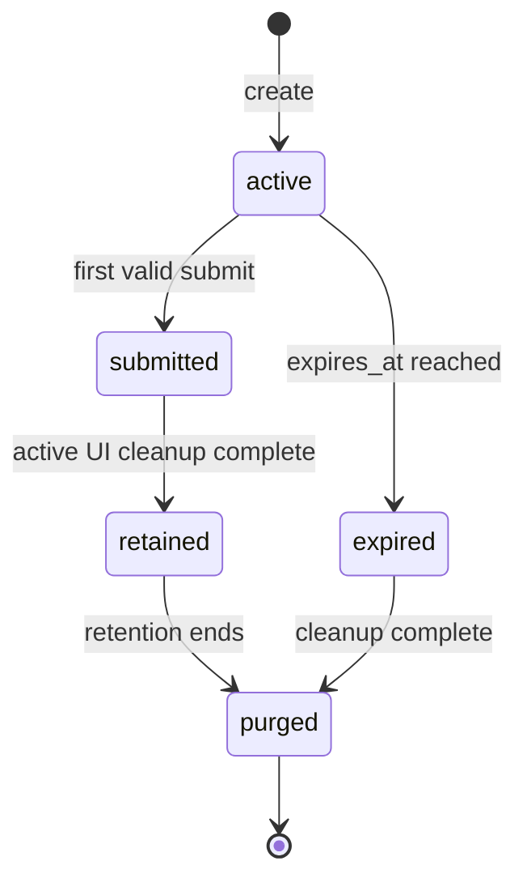
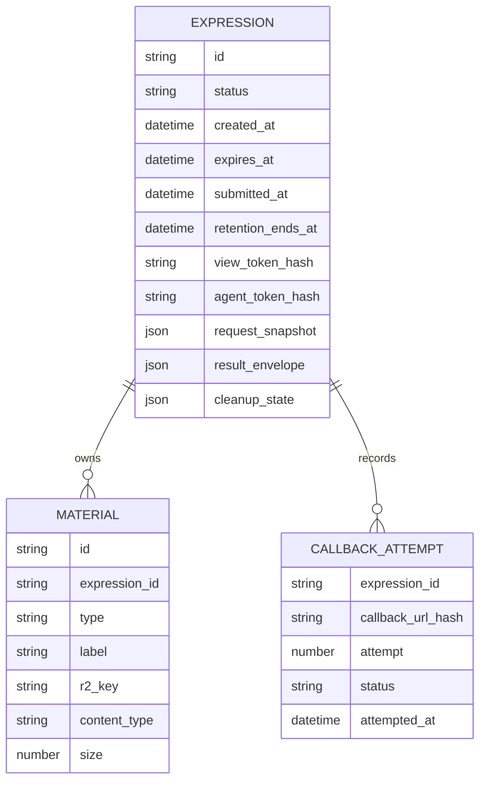

# feat: Build Cloudflare Isolated Expression MVP

## Overview

Build the first vertical slice of **ephemeral.page**: an agent creates one temporary public expression, a human opens the generated page and submits one result, and the invoking agent polls the result. The plan carries forward the origin decision that the request/API surface can be shared, but each generated human-facing UI must be isolated as its own one-off runtime unit (see origin: `docs/brainstorms/2026-05-01-ephemeral-page-cloudflare-isolated-mvp-requirements.md`).

The MVP should run entirely on Cloudflare Developer Platform primitives, use TypeScript, and keep the codebase small and inspectable. The critical success path is not visual polish; it is trustworthy lifecycle behavior: create, serve, submit once, poll, expire, and clean up.

## Problem Statement

Agents need a public, temporary way to ask a human for one focused interaction without hand-building UI. Security-conscious users also need confidence that generated UI and stored results are not casually multitenant. The system must therefore combine two things that usually pull against each other:

- a simple shared HTTP API for any agent that can call and share URLs
- isolated, ephemeral resources for each generated page and response lifecycle

The origin explicitly rejects exposed form templates, rigid request schemas beyond the minimal API contract, arbitrary generated backend powers, and MCP UI as the core primitive (see origin: `docs/brainstorms/2026-05-01-ephemeral-page-cloudflare-isolated-mvp-requirements.md`).

## Proposed Solution

Create a Cloudflare Worker control plane with:

- API routes for expression creation, page serving, submission, status, result polling, material serving, and callback queue consumption.
- One Durable Object instance per expression as the authoritative state owner for capability verification, status transitions, result storage, one-response locking, alarms, and cleanup.
- An isolated expression UI runtime selected at implementation start:
  - Preferred: Dynamic Workers with a Durable Object supervisor/facet pattern.
  - Fallback: Workers for Platforms untrusted dispatch namespace with one generated user Worker per expression.
- Private R2 storage for expression-scoped generated assets and mirrored materials when a material URL is provided.
- Queues for callback delivery retries.
- AI composition through a composable service that production can back with Workers AI or an external model provider through AI Gateway; tests use a deterministic mock composer.

The generated UI receives only render inputs and the platform submit script. It receives no R2, Durable Object, Queue, model, secret, account API, or result-read capability (see origin R18).

## Architecture

```mermaid
flowchart LR
  A["Agent"] -->|POST /api/expressions| W["Control Plane Worker"]
  W --> C["AI Composer"]
  W --> R2["Private R2: expression assets/materials"]
  W --> DO["Expression Durable Object"]
  DO --> UI["Isolated UI Runtime"]
  H["Human with page capability"] -->|GET /e/:id/:view_token| W
  W -->|active only| UI
  UI -->|window.ephemeral.submit(result)| W
  W --> DO
  DO -->|callback event| Q["Callback Queue"]
  Q --> CB["Agent callback URL"]
  A -->|GET result/status with agent capability| W
  W --> DO
```

### State Model



### Data Ownership



The Durable Object is the authoritative storage boundary for the expression record. R2 is only for larger generated assets/material blobs. Callback attempt details can live either in Durable Object storage or queue logs; do not make them authoritative for result delivery.

## Implementation Phases

### Phase 0: Project Scaffold and Platform Decision

- Create a TypeScript Cloudflare Workers project with Wrangler, Vitest, and generated Worker runtime types.
- Add `docs/brainstorms/2026-05-01-ephemeral-page-cloudflare-isolated-mvp-requirements.md` as the origin reference in README or project notes.
- Check whether the target Cloudflare account has Dynamic Workers enabled.
- If Dynamic Workers are available, implement the `ExpressionRuntimeDriver` with Dynamic Workers/Durable Object facets.
- If Dynamic Workers are unavailable, implement the driver with Workers for Platforms in an untrusted dispatch namespace.
- Keep the driver boundary narrow so tests can use a fake runtime driver without weakening the production isolation goal.
- Add a local development profile that uses simulated Cloudflare bindings, a deterministic composer, and a fake isolated-runtime driver so the full create -> view -> submit -> poll loop runs on localhost.

Deliverable: project boots locally, the product loop works through `wrangler dev`, tests can import Worker handlers, and runtime driver choice is documented.

### Phase 1: Core Expression Lifecycle

- Implement `POST /api/expressions`.
- Parse and validate:
  - `intent`
  - optional `materials`
  - optional `result.desired_shape`
  - optional `result.callback_url`
  - `expires_in`
- Generate:
  - expression ID
  - human view/submit capability
  - agent result/status capability
  - `expires_at`
  - `retention_ends_at`, defaulting to `expires_at` for MVP
- Store only hashes of capability tokens.
- Create the per-expression Durable Object state.
- Return tokenized `url`, `result_url`, and `status_url`.

Acceptance mapping: R1, R2, R14, R15, R16, R23.

### Phase 2: AI Page Composition and Isolated Runtime

- Implement the composer service:
  - Production path: model-backed composition through Workers AI or provider behind AI Gateway.
  - Test/dev path: deterministic composer fixture.
- Ask the composer for internal page parts, not agent-visible templates:
  - title
  - body HTML
  - CSS
  - JavaScript
  - expected result hints
- Assemble the page in a platform shell that injects:
  - `window.ephemeral.submit(result)`
  - a CSP nonce
  - terminal-state fallback markup
  - local material URLs
- Block external scripts and arbitrary backend access with CSP and runtime binding design.
- Deploy/load the isolated UI through the chosen runtime driver.

Acceptance mapping: R3, R4, R5, R6, R7, R13, R18.

### Phase 3: Serving, Submitting, and Polling

- Implement `GET /e/:id/:view_token`.
  - If active and token is valid, serve the isolated generated UI.
  - If submitted, expired, or purged, serve a minimal terminal page from the platform worker/supervisor rather than the generated runtime.
- Implement `POST /api/expressions/:id/submit`.
  - Require valid human capability.
  - Reject expired expressions.
  - Accept exactly the first valid submission.
  - Store a stable result envelope.
  - Trigger immediate active UI cleanup.
  - Enqueue callback if configured.
- Implement `GET /api/expressions/:id/status`.
- Implement `GET /api/expressions/:id/result`.
  - Require valid agent capability.
  - Return pending before submission.
  - Return submitted envelope after submission.
  - Return expired/gone envelope after expiry or retention purge.

Acceptance mapping: R6, R8, R9, R10, R11, R21, R22, R26.

### Phase 4: Materials and Asset Handling

- For MVP security, mirror supported remote materials into private R2 during creation.
- Only accept `https:` material URLs.
- Enforce maximum size, content type allowlist, and fetch timeout.
- Store mirrored materials under `expressions/:id/materials/:material_id`.
- Serve materials only through expression-scoped routes that validate the human capability while active.
- Delete or lifecycle-expire expression material prefixes during cleanup.
- If a material cannot be mirrored, fail creation with a clear validation error rather than silently leaking browser requests to arbitrary origins.

Acceptance mapping: R19 and the security success criteria from the origin.

### Phase 5: Expiry, Retention, and Cleanup

- Use Durable Object alarms for scheduled expiry and retention cleanup.
- Model cleanup as idempotent lifecycle operations:
  - `closeActiveFlow`: stop serving active UI after submit or expiry.
  - `deleteRuntime`: delete Dynamic Worker facet or Workers for Platforms script.
  - `deleteAssets`: remove generated assets/material mirrors from R2.
  - `purgeResult`: remove result data after retention ends.
  - `leaveTombstone`: preserve only enough state to answer expired/gone without returning result data.
- On successful submission:
  - transition `active -> submitted`
  - immediately close active UI
  - keep result available to the agent until `retention_ends_at`
- On expiry without submission:
  - transition `active -> expired`
  - close active UI
  - delete runtime/assets
- On retention end:
  - remove result data and capability hashes if no longer needed
  - return a stable gone/expired response shape for future polls

Acceptance mapping: R11, R12, R21, R22, R23, R24, R25, R26.

### Phase 6: Callback Delivery

- Validate callback URLs at create time:
  - `https:` only
  - no credentials in URL
  - no fragment
  - bounded length
- On accepted submission, enqueue a callback job containing expression ID and a reference to the stored result envelope.
- Queue consumer fetches the result from the Durable Object and posts it to the callback URL.
- Retry transient callback failures using Queues retry behavior.
- Record callback attempt metadata without making callback success required for polling.

Acceptance mapping: R10.

### Phase 7: Tests and Verification

- Use Cloudflare Workers Vitest integration for local runtime tests.
- Unit-test pure helpers:
  - duration parsing
  - capability generation and verification
  - callback URL validation
  - result envelope shaping
  - CSP/page assembly
- Integration-test Worker and Durable Object behavior:
  - create expression
  - serve active generated page
  - reject invalid human token
  - submit first result
  - reject double submit
  - poll before submit
  - poll after submit
  - reject result polling without agent token
  - reject human token on result endpoint
  - expire expression
  - close active UI after submit
  - cleanup driver invoked idempotently
  - purge result after retention
- Use mocked composer, mocked callback target, and fake runtime driver in the local test suite.
- Add a short remote smoke-test checklist for the selected isolated runtime primitive, because Dynamic Workers and Workers for Platforms behavior may not be fully covered by local mocks.

Acceptance mapping: R20 plus cleanup/security criteria.

## System-Wide Impact

### Interaction Graph

- Create expression triggers validation, optional material mirroring, AI composition, Durable Object initialization, isolated runtime creation/loading, and response envelope generation.
- Page view triggers capability verification, status check, and either isolated UI runtime fetch or terminal page rendering.
- Submit triggers human capability verification, one-response lock, result storage, active UI cleanup, callback enqueue, and terminal state for future human views.
- Expiry alarm triggers state transition, runtime deletion/disablement, R2 cleanup, and later result purge.

### Error and Failure Propagation

- Validation failures return 400 with structured errors.
- Missing/invalid capabilities return 404 or 403 consistently; prefer 404 for human page/resource discovery resistance.
- Double submit returns 409 conflict.
- Expired submissions return 410 gone.
- Composer failures return 502/503 and do not create a partially active expression.
- Material mirroring failures return 400 for invalid material or 502 for fetch failure; do not create an expression with missing required materials.
- Runtime cleanup failures should not reopen an expression. They are recorded in cleanup state and retried by alarm/sweeper.
- Callback failures never change result polling status.

### State Lifecycle Risks

- Partial create can orphan R2 objects or runtime scripts. Mitigate with create transaction ordering, cleanup-on-failure, and prefix-based sweeper.
- Concurrent submits can race. Mitigate by making the Durable Object the only submit authority.
- Dynamic runtime deletion can fail after result is stored. Mitigate with idempotent cleanup state and retry alarms.
- Purging result too early breaks polling. MVP default keeps result until `expires_at`; active UI closes immediately after submission.
- Capability token leakage grants bearer access. Mitigate with high-entropy tokens, hashes at rest, no cookies, strict no-referrer headers, and short expirations.

### API Surface Parity

The public HTTP API is the agent interface. There is no separate UI/dashboard in MVP. Any future MCP tool or Welcome Mat wrapper must call the same create/status/result lifecycle rather than bypassing it.

### Integration Test Scenarios

- Agent creates audio review expression, human submits once, agent polls result, second human submission fails.
- Human opens link after another human submitted; page shows submitted terminal state and no active controls.
- Agent polls before human action; receives pending without result data.
- Expression expires before submit; human page and submit endpoint are gone, agent result endpoint returns expired.
- Callback URL fails twice; agent polling still returns submitted result.
- Cleanup runs twice from submit and alarm; runtime/assets are not recreated and no error leaks to users.

## Acceptance Criteria

### Functional Requirements

- [x] `POST /api/expressions` creates an expression from intent, optional materials, desired result shape, callback URL, and expiration.
- [x] Create response includes ID, human URL, agent result URL, agent status URL, and `expires_at`.
- [x] Human URL includes only the human capability.
- [x] Agent result/status URLs include only the agent retrieval capability.
- [x] Generated page is AI-composed, mobile-friendly, accessible by default, and not selected from agent-visible templates.
- [x] Generated page exposes `window.ephemeral.submit(result)`.
- [x] First valid submission stores the result and returns success.
- [x] Second submission returns conflict.
- [x] Result polling before submission returns pending envelope.
- [x] Result polling after submission returns submitted envelope with `submitted_at` and flexible `result`.
- [x] Expired expression cannot be viewed or submitted as active work.
- [x] Completed human flow immediately stops serving active UI after submission.
- [x] Completed/expired human links show terminal state only.
- [x] Callback failure does not prevent polling.
- [x] Cleanup disables/deletes isolated runtime and generated resources.
- [x] Result data is purged after retention, returning stable expired/gone response.

### Non-Functional Requirements

- [x] TypeScript throughout.
- [x] Minimal runtime dependencies.
- [x] No generated UI access to privileged Cloudflare bindings.
- [x] Capability tokens are high entropy and stored only as hashes.
- [x] R2 material storage is private and expression-scoped.
- [x] No public R2 bucket for generated/material assets.
- [x] CSP blocks external scripts and narrows network access.
- [x] APIs avoid cookie-based auth so CSRF is not part of the trust model.
- [x] Code remains readable enough for a new repo: small modules, explicit lifecycle states, no broad framework ceremony.

### Quality Gates

- [x] Vitest suite covers origin-required tests: create, serve, submit, double-submit rejection, poll-before-submit, poll-after-submit, expired expression.
- [x] Additional tests cover invalid tokens, terminal page after submit, cleanup idempotency, retention purge, and callback failure.
- [ ] Remote smoke test verifies the selected isolated runtime primitive in Cloudflare.
- [x] Local development mode demonstrates create -> open page -> submit -> poll result without live AI or real Dynamic Workers/Workers for Platforms.
- [x] README documents local development, test commands, required Cloudflare bindings/secrets, and current runtime backend choice.

## Implementation Notes

### API Contract

MVP endpoints:

- `POST /api/expressions`
- `GET /e/:id/:view_token`
- `GET /e/:id/:view_token/materials/:material_id`
- `POST /api/expressions/:id/submit`
- `GET /api/expressions/:id/result`
- `GET /api/expressions/:id/status`

Use tokenized URLs for the MVP. Later Welcome Mat / DPoP support can add proof-bound `Authorization` semantics without changing the underlying lifecycle state.

### Runtime Driver Boundary

Define one internal driver interface conceptually responsible for:

- create or load expression runtime
- serve active UI
- close active UI
- delete runtime resources
- report cleanup status

The rest of the application should not know whether the driver is Dynamic Workers or Workers for Platforms. This avoids baking beta availability into business logic.

### Local Development Mode

Support a local form of the service that runs the full product loop without requiring every Cloudflare production primitive to be available locally:

- `wrangler dev` runs the control plane Worker against local/simulated bindings.
- Durable Object state runs locally through the Workers runtime/Miniflare simulation.
- R2 material storage uses local simulated R2 or an in-memory/local-disk adapter in tests.
- Queue behavior can be tested with a local queue consumer path or direct callback-consumer invocation.
- Composer uses a fixture implementation that produces deterministic HTML/CSS/JS.
- Runtime driver uses a fake isolated runtime that stores the generated page in local state and serves it through the same `GET /e/:id/:view_token` path.

This local mode is intentionally a functional approximation, not proof of production isolation. The production runtime driver still needs a remote smoke test for Dynamic Workers or Workers for Platforms before launch.

### Composer Boundary

Define the composer as a replaceable service:

- request: intent, materials summary, desired result shape, accessibility/mobile instructions
- response: page parts and any validation metadata

Tests should not call live models. Production should fail closed if no composer is configured.

### Retention Default

For MVP, `expires_in` controls both human page expiry and agent result retention. Submission closes the human UI immediately, but the result remains pollable until `expires_at`. A future API can split this into `expires_in` and `result_retention`.

## Dependencies and Prerequisites

- Cloudflare account with Workers and Durable Objects.
- Dynamic Workers access, or Workers for Platforms dispatch namespace and API token.
- R2 bucket for expression assets/materials.
- Queue for callback delivery.
- AI binding/provider configuration for production composer.
- Default Workers AI production composer model: `@cf/google/gemma-4-26b-a4b-it`.
- Secrets/Secrets Store entries for model/provider keys and, if using Workers for Platforms cleanup/upload APIs, Cloudflare API token with narrow script permissions.

## Risk Analysis and Mitigation

- Dynamic Workers availability: Check before implementation. Use Workers for Platforms fallback if unavailable.
- Workers for Platforms API token risk: Store token as a secret, scope narrowly, and keep generated Workers untrusted.
- Generated HTML/JS risk: No privileged bindings, CSP, no external scripts, no agent token in human page.
- URL capability leakage: Use short default expirations, no-referrer headers, token hashes at rest, and separate human/agent capabilities.
- Callback SSRF/abuse: Require HTTPS, validate URLs, bound timeouts, disable redirects or tightly control them, and keep polling authoritative.
- Material fetch abuse: Enforce type/size/time limits and reject unsupported materials.
- Cleanup drift: Use idempotent cleanup state, DO alarms, and optional sweeper route/job.
- Test realism gap: Use local tests for lifecycle invariants and a remote smoke checklist for actual isolated runtime behavior.

## Future Considerations

- Welcome Mat / DPoP agent authentication for result/status endpoints.
- MCP wrapper/tool around the HTTP API.
- Admin/debug dashboard for failed cleanup and callback retries.
- Richer result validation against desired shape.
- Optional split between human-page expiration and result-retention expiration.
- Domain/custom-branding controls only after the core lifecycle is robust.

## Documentation Plan

- Add README sections for:
  - product loop
  - API examples
  - capability-link security model
  - lifecycle states and cleanup behavior
  - local development
  - Cloudflare bindings/secrets
  - test commands
- Keep the origin requirements doc linked from the README and this plan.

## Sources and References

### Origin

- **Origin document:** [docs/brainstorms/2026-05-01-ephemeral-page-cloudflare-isolated-mvp-requirements.md](../brainstorms/2026-05-01-ephemeral-page-cloudflare-isolated-mvp-requirements.md)
- Key decisions carried forward: Cloudflare-only architecture, shared control plane with isolated expression runtime, Durable Object state authority, Dynamic Workers preferred with Workers for Platforms fallback, capability-link MVP auth, two-phase lifecycle cleanup.

### Local Research

- Current repo contains no implementation code, no project-local `AGENTS.md`/`CLAUDE.md`, and no project-local `docs/solutions/`.
- Existing artifact: [docs/brainstorms/2026-05-01-ephemeral-page-cloudflare-isolated-mvp-requirements.md](../brainstorms/2026-05-01-ephemeral-page-cloudflare-isolated-mvp-requirements.md)

### External Documentation

- [Cloudflare Workers](https://developers.cloudflare.com/workers/)
- [Cloudflare TypeScript Workers](https://developers.cloudflare.com/workers/languages/typescript/)
- [Cloudflare Durable Objects](https://developers.cloudflare.com/durable-objects/)
- [Durable Object Alarms](https://developers.cloudflare.com/durable-objects/api/alarms/)
- [Dynamic Workers](https://developers.cloudflare.com/dynamic-workers/)
- [Dynamic Workers Durable Object Facets](https://developers.cloudflare.com/dynamic-workers/usage/durable-object-facets/)
- [Workers for Platforms architecture](https://developers.cloudflare.com/cloudflare-for-platforms/workers-for-platforms/how-workers-for-platforms-works/)
- [Workers for Platforms worker isolation](https://developers.cloudflare.com/cloudflare-for-platforms/workers-for-platforms/reference/worker-isolation/)
- [Workers for Platforms bindings/resource isolation](https://developers.cloudflare.com/cloudflare-for-platforms/workers-for-platforms/configuration/bindings/)
- [Cloudflare R2 object lifecycles](https://developers.cloudflare.com/r2/buckets/object-lifecycles/)
- [Cloudflare Queues](https://developers.cloudflare.com/queues/)
- [Cloudflare AI Gateway features](https://developers.cloudflare.com/ai-gateway/features/)
- [Cloudflare Workers Vitest integration](https://developers.cloudflare.com/workers/testing/vitest-integration/)
